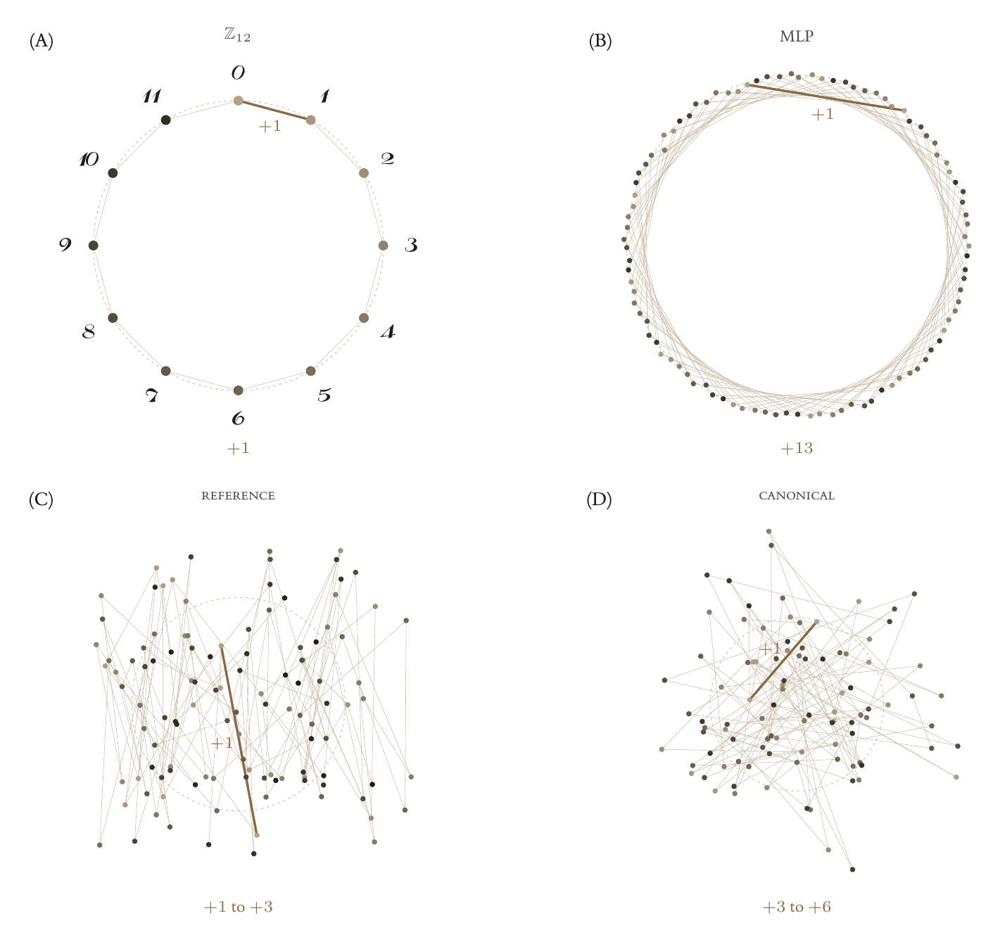
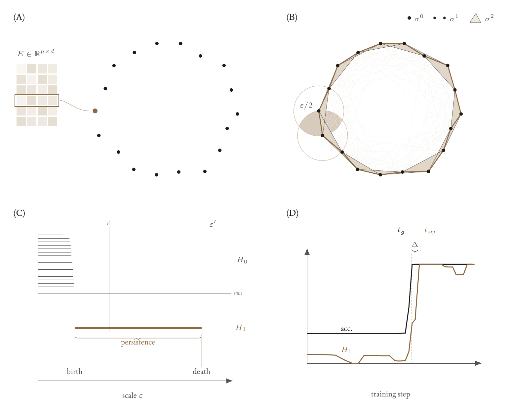

# grokking-tda

[](https://github.com/omar-chishti/grokking-tda/actions/workflows/ci.yml)
[](LICENSE)


The code behind *Topology of Grokking* (MSc thesis, Department of Computing, Imperial College
London). It trains small models on modular arithmetic, records every run as an immutable artifact,
and computes persistent homology of the learned representations beside the cheaper diagnostics it
has to beat: Fourier concentration, weight norm, intrinsic dimension. Every number and figure in
the thesis regenerates from the tables committed here.

<p align="center"></p>

<p align="center"><sub>Residue embeddings threaded in residue order. On the MLP the thread closes into a star polygon; the two transformer recipes reach the same test accuracy on very different geometries.</sub></p>

## Install

```bash
uv sync     # CUDA wheels on Linux, CPU on macOS, from the committed lockfile
```

## Run

Training runs once and writes a self-describing artifact; analysis reads that artifact and never
retrains.

```bash
uv run gtda-train +experiment=smoke                        # ~10 s end to end
uv run gtda-analyse results/raw/transformer_add11_f0.5_wd1.0_softmax_ce_s0
uv run gtda-plot    results/raw/transformer_add11_f0.5_wd1.0_softmax_ce_s0

uv run gtda-train +experiment=tf_mod97_grok train.device=cpu   # a real grokking run
uv run gtda-train -m +experiment=tf_mod97_grok seed=0,1,2      # a sweep
```

Configs compose from typed Hydra presets (`mlp_mod97_grok`, `tf_mod97_stablemax`,
`tf_s5_grok`, …) and every field is overridable on the command line. Each run's `manifest.json`
records the resolved config, library versions, platform, hardware and commit. On Apple silicon pass
`train.device=cpu` for anything you report: MPS has no float64, and the cross-entropy is computed
in double precision.

<p align="center"></p>

<p align="center"><sub>From a representation to a point cloud, a Vietoris–Rips complex, a barcode, and a scalar timed against test accuracy.</sub></p>

## Reproduce the thesis

```bash
uv run python -m analysis.thesis_numbers     # every quoted number, as a printed ledger
uv run python -m analysis.figures.build      # one tidy CSV per figure
uv run python -m analysis.figures.render     # vector PDFs from those CSVs
```

The first writes `results/processed/thesis/{bank,conditions,circularity}.csv` and `claims.json`;
the second writes `results/processed/thesis/figures/*.csv`; the third writes
`results/figures/generated/*.pdf`, or into a manuscript tree if one sits beside the repository.
`results/processed/thesis/README.md` maps every committed table to the module that wrote it. The
raw artifact store (`results/raw/`, about 3 GB) is not tracked; the run programme that produced it
is `experiments/*.runs`, one line of overrides per run with the intended reading in each file's
header, and `scripts/remote/` is the orchestration that ran it on a pool of shared GPU workstations.

## Layout

```
src/grokking_tda/   the framework: models, engine, artifact contract, TDA, baselines, evaluation
analysis/           the reduction: a bank of runs -> the tables and figures the thesis quotes
results/processed/  the tidy tables behind every number and figure
experiments/        the run programme, as checked-in data
tests/              193 tests over the framework, plus an import check on the reduction layer
docs/               architecture and the decision records
sidequest/          a self-contained side study with its own results tree
```

`src/` holds the method and is unit tested; `analysis/` imports it and never reimplements it.
Persistence carries the units of the cloud it is measured on, and that scale moves by orders of
magnitude across training, so every summary is reported raw and scale-normalised
([ADR 0005](docs/decisions/0005-scale-normalised-persistence.md)). See
[`docs/ARCHITECTURE.md`](docs/ARCHITECTURE.md) and [`analysis/README.md`](analysis/README.md).

## Development

```bash
uv run pytest && uv run ruff check src tests analysis sidequest scripts && uv run mypy
```

## Citation and licence

MIT ([`LICENSE`](LICENSE)); cite via [`CITATION.cff`](CITATION.cff). The thesis text is not in
this repository. The framework was written through May and June 2026 and placed under version
control on 18 June, so the history opens with a baseline commit.
