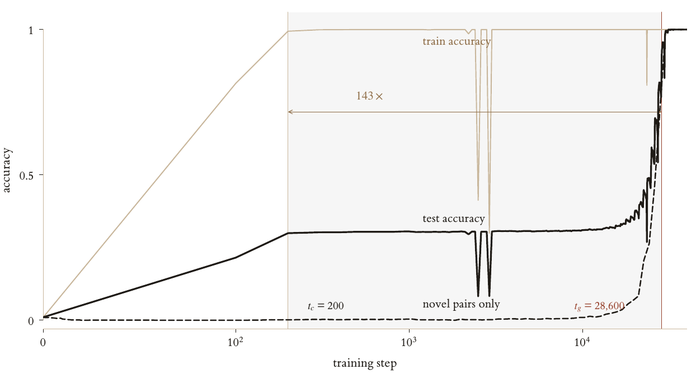
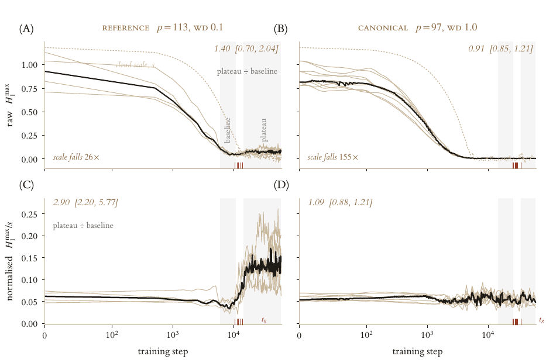

# grokking-tda

[](https://github.com/omar-chishti/grokking-tda/actions/workflows/ci.yml)
[](LICENSE)


A framework for measuring topological signatures of **grokking**. It trains small models on
modular arithmetic, records each training trajectory as an immutable artifact, and computes
persistent homology over training beside the cheap baselines it would have to beat — Fourier
concentration, weight norm, local intrinsic dimension — so the comparison is built into the design.



## Installation

```bash
uv sync     # CUDA wheels on Linux, MPS/CPU on macOS, from the committed lockfile
```

## Usage

Training runs once and writes a self-describing artifact; analysis runs off that artifact many
times, never touching a GPU.

```bash
uv run gtda-train +experiment=smoke          # ~10 s end to end

RUN=results/raw/transformer_add11_f0.5_wd1.0_softmax_ce_s0
uv run gtda-analyse $RUN                     # observables, transitions, lead/lag
uv run gtda-plot    $RUN                     # vector PDFs

# a real grokking run: minutes on a GPU, about an hour on a laptop CPU
uv run gtda-train +experiment=tf_mod97_grok train.device=cpu
```

Configs compose from typed Hydra presets and every field is overridable from the command line.
Each run records its resolved config, library versions, platform, hardware and git commit in
`manifest.json`; the runs behind `results/` were trained from a synced worktree with no `.git`, so
they carry a null commit.

```bash
uv run gtda-train +experiment=mlp_mod97_grok                    # MLP track
uv run gtda-train +experiment=tf_mod97_stablemax                # StableMax intervention
uv run gtda-train +experiment=tf_s5_grok                        # composition in S_5
uv run gtda-train -m +experiment=tf_mod97_grok seed=0,1,2       # sweep
```

> On Apple silicon pass `train.device=cpu` for anything you intend to report: MPS has no float64,
> so the high-precision cross-entropy silently degrades to float32.



Persistence carries the units of the cloud it is measured on, and that scale moves by orders of
magnitude across training. Every summary is therefore reported both raw and scale-normalised
([ADR 0005](docs/decisions/0005-scale-normalised-persistence.md)).

## Layout

```
src/grokking_tda/   the framework: models, engine, artifact contract, TDA, baselines, evaluation
analysis/           the reduction layer: a bank of runs -> the tables and figures a write-up quotes
results/processed/  the tidy table behind every number and figure, small enough to track
tests/              191 tests over the framework, plus an import check on the reduction layer
experiments/        the run programme, as checked-in data
scripts/remote/     orchestration for a pool of shared GPU workstations
docs/               architecture and the architecture decision records
sidequest/          a self-contained study that must not reach the main bank, tree and all
results-stride1/    trajectories re-recorded at every optimiser step, in their own tree
results-sidequest/  the side quest's artifact store, likewise
```

`src/` holds the method and is unit tested; `analysis/` holds the reduction, imports the method and
never reimplements it. To rebuild every number and figure from an artifact store:

```bash
uv run python -m analysis.thesis_numbers     # every headline number, as a printed ledger
uv run python -m analysis.figures.build      # one tidy CSV per figure
uv run python -m analysis.figures.render     # vector PDFs from those CSVs
```

See [`docs/ARCHITECTURE.md`](docs/ARCHITECTURE.md) for the design and
[`analysis/README.md`](analysis/README.md) for the reduction layer.

## Development

```bash
uv run pytest
uv run ruff check src tests analysis sidequest scripts
uv run mypy
```

## Citation and licence

Code is MIT ([`LICENSE`](LICENSE)); cite via [`CITATION.cff`](CITATION.cff). The accompanying
thesis text is not in this repository. The framework was written through May and June 2026 and
placed under version control on 18 June, so the history opens with a baseline commit.
